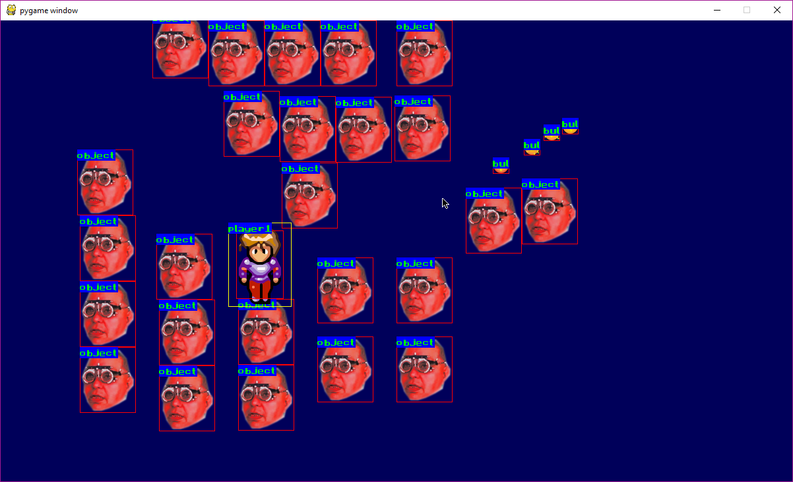

Simple game engine written in python with pygame library.  
Still a work in progress.  
  
### What i want to achieve: 
- [x] easy object animation with spritesheets
- [x] collision detection
- [x] simple physics with speed, acceleration and object bounce
- [x] simple object spawning with single line of code
- [ ] spawners - objects spawning other objects  
- [x] object tree handling
- [ ] object definitions in another file (YAML)
- [ ] object creation from other files
- [x] drawing layers
  
This is how it looks at the moment:  
  
