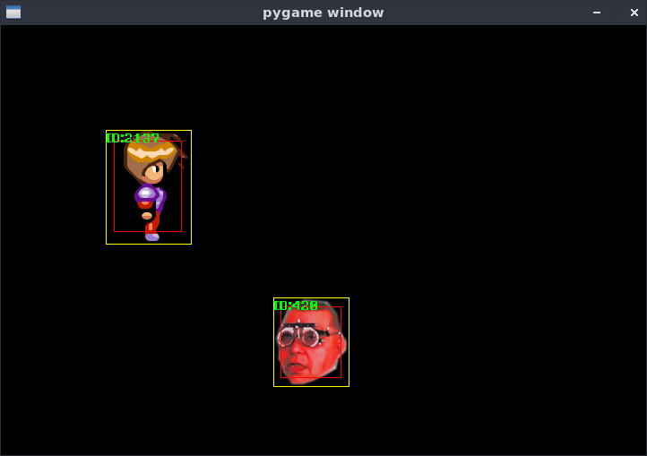

Simple game engine written in python with pygame library.  
Still a work in progress.  
  
What i want to achieve: 
 * easy object animation with spritesheets 
 * collision detection and handling  
 * simple physics with speed, acceleration and object bounce  
 * simple object spawning with single line of code  
 * spawners - objects spawning other objects  
 * object tree handling  
 * object definitions in another file (YAML)  
 * object creation from other files  
  
First achievement:  
  
